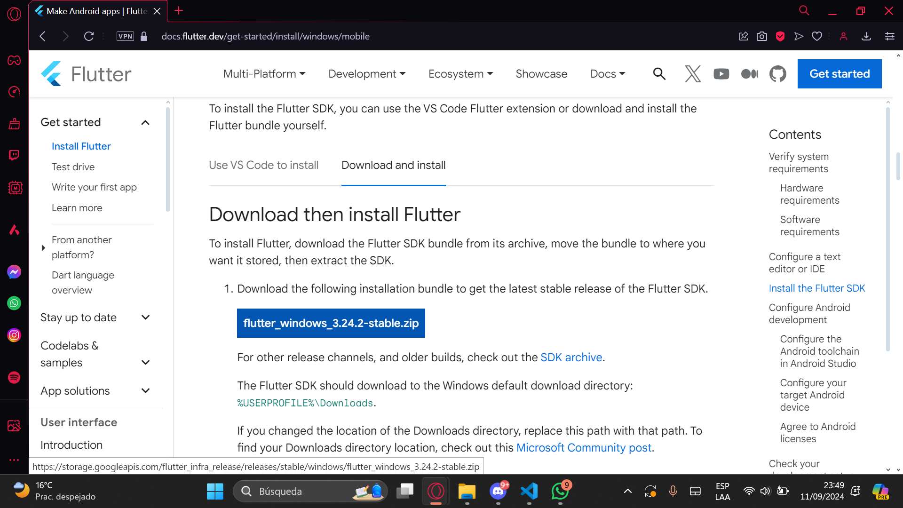
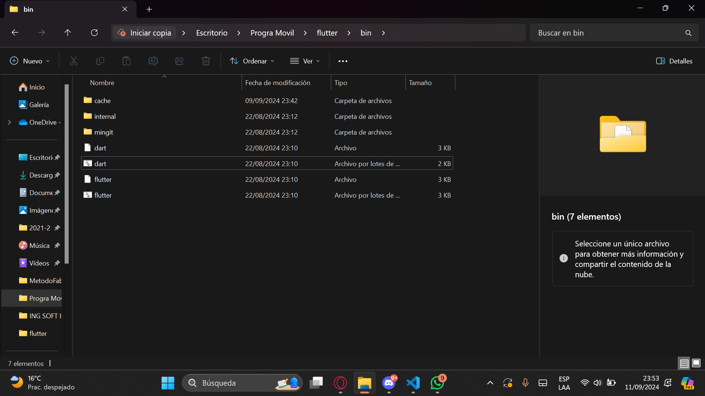
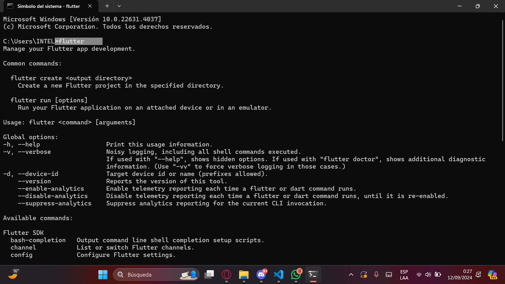
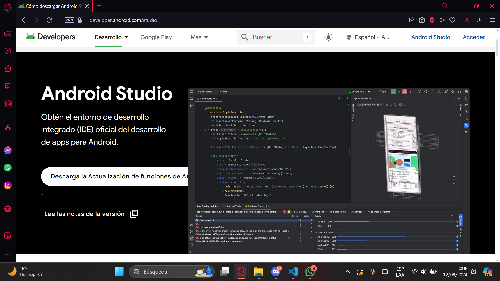

<h1 style="text-align: center; font-size: 48px;">TRIBU</h1>

Tribu es un aplicativo movil pensado en ser una herramienta de gran utilidad para la comunidad de la universidad de Lima.Los usuarios podrán tener acceso a basta información de profesores por reseñas hechas por otros estudiantes, buscar materiales de estudio de acuerdo a los cursos que desee, compartir ideas y sus aportes en archivos a traves de publicaciones, fomentar el dialogo abierto en los comentarios de los posts, entre otras actividades.

# Índice

- [Entorno de Desarrollo](#entorno-de-desarrollo)
- [Diagrama de Despliegue](#diagrama-de-despliegue)
- [Requerimientos Funcionales](#requerimientos-funcionales)
- [Requerimientos No Funcionales](#requerimientos-no-funcionales)
- [Diagrama Casos de Uso](#diagrama-casos-de-uso)
- [Descripción de Casos de Uso](#descripcion-de-casos-de-uso)

# Entorno de Desarrollo

Para el desarrollo de nuestro aplicativo Android se trabaja con el framework multiplataforma Flutter SDK 24.0, el cual se descargó el archivo zip desde su sitio oficial .https://docs.flutter.dev/get-started/install/windows. 


Luego de descomprimir el archivo ubicamos la carpeta bin y añadimos esta ruta a las variables de entorno del sistema. Esto nos permitirá ejecutar los comandos de Flutter en nuestra terminal.




Para compilar la aplicación se utiliza el entorno de Android Studio, aquí creamos un emulador de dispositivo móvil para visualizar lo que se esté desarrollando. https://developer.android.com/studio/install?hl=es-419




Como preferencia del equipo, utilizamos Visual Studio Code como editor de código fuente. https://code.visualstudio.com/download. Descargamos la extensión de Flutter 


# Diagrama de Despliegue

Aquí va la información sobre el diagrama de despliegue.

# Requerimientos Funcionales

### 1. Gestión de Materiales Académicos
- RF 1.1: Permitir a los usuarios acceder a materiales de cursos anteriores.
- RF 1.2: Categorizar los materiales por asignatura y semestre 
- RF 1.3: Descargar y visualizar documentos en formatos comunes (PDF, DOCX, PPT,).
- RF 1.4: Buscar materiales específicos mediante palabras clave o filtros.
### 2. Gestión de Profesores
- RF 2.1: Mostrar una lista de profesores asociados a la universidad.
- RF 2.2: Permitir filtrar y ordenar profesores por departamento, nombre o calificación.
- RF 2.3: Ver perfiles detallados de cada profesor, incluyendo información de cursos que dicta, carrera y valoración de los alumnos.
### 3. Calificación y Reseñas de Profesores
- RF 3.1: Permitir a los estudiantes calificar a los profesores mediante un sistema de estrellas.
- RF 3.2: Facilitar la redacción y publicación de reseñas o comentarios sobre la experiencia con el profesor.
- RF 3.3: Permitir a los usuarios reportar reseñas que consideren inapropiadas.
### 4. Horario de Asesorías
- RF 4.1: Mostrar los horarios de asesorías del profesor en su respectivo perfil.
### 5. Autenticación y Gestión de Usuarios
- RF 5.1: Registro y login de usuarios mediante correo electrónico y contraseña.
- RF 5.2: Recuperación de contraseña.
- RF 5.3: Gestión de perfil de usuario, incluyendo información personal y materias que está cursando .
### 6. Notificaciones y Comunicaciones
- RF 6.1: Enviar notificaciones push para actualizaciones de materiales, nuevas reseñas o cambios en horarios de asesorías.
### 7. Búsqueda y Filtrado
- RF 8.1: Implementar una barra de búsqueda global para encontrar materiales y reseñas de profesores. 
### 8 Publicaciones de los usuarios
- RF 8.1: Permitir a los usuarios hacer publicaciones en el Muro, subir una imagen, archivos. 


# Requerimientos No Funcionales

### 1. Almacenamiento en una base de datos
- RNF 1.1: Se integra a una base de datos para almacenar materiales, perfiles y reseñas.
- RNF 1.2: Permite al usuario Administrador gestionar la base de datos 
### 2. Gestión de datos sensibles
- RNF 2.1: Garantizar la privacidad de los datos e información brindados por el usuario.
### 3. Diseño  y Responsividad
- RNF 3.1: La aplicación será responsive, adaptándose a diferentes tamaños de pantalla, cumpliendo con el estándar de Android 10+.
- RNF 3.2: La aplicación incluirá temas de colores predefinidos para mejorar la usabilidad y estética.


# Diagrama Casos de Uso

Aquí va la información sobre el diagrama de casos de uso.

# Descripción de Casos de Uso

Aquí va la descripción detallada de los casos de uso.


```bash
# Clona el repositorio
git clone https://github.com/usuario/proyecto.git

# Entra en el directorio del proyecto
cd proyecto

# Instala las dependencias
npm install
