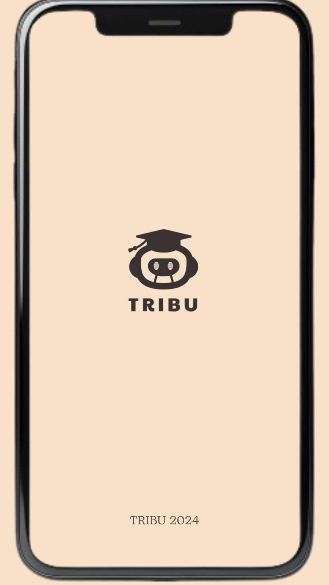
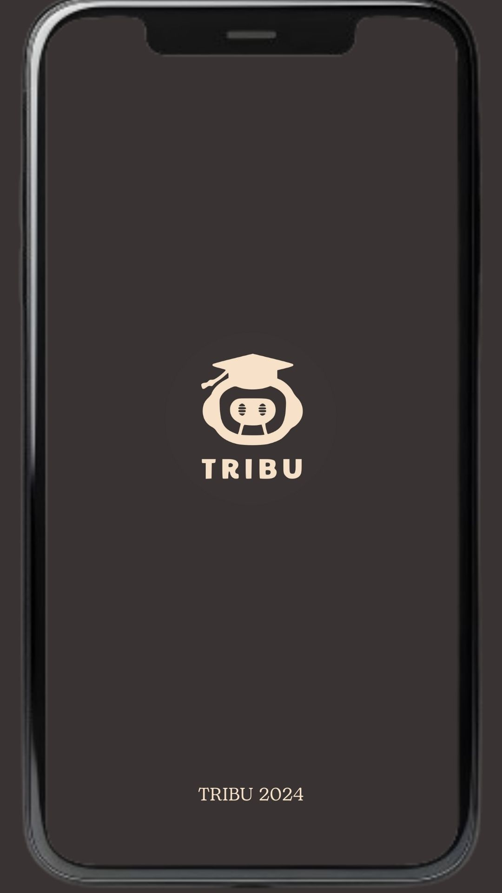
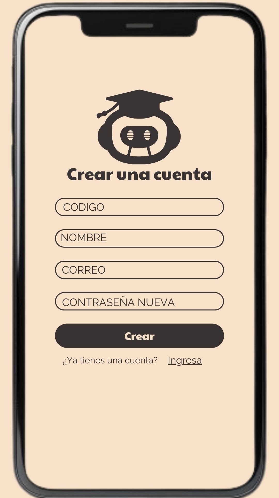
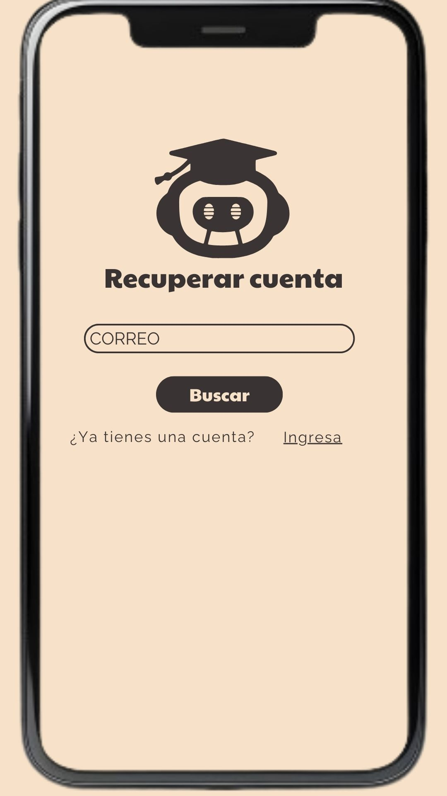
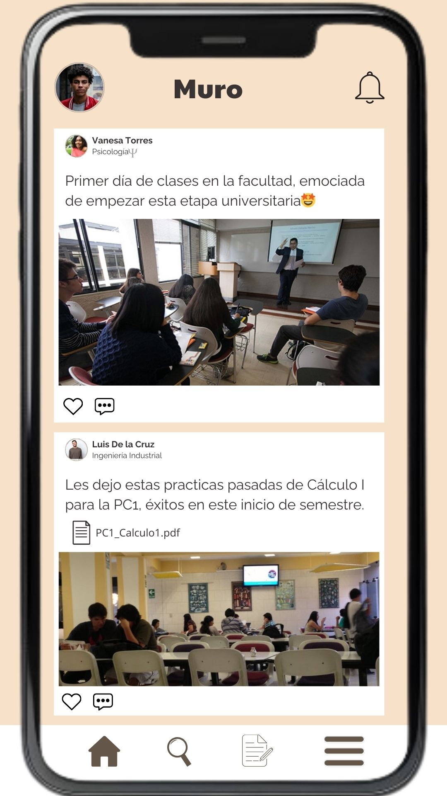

<h1 style="text-align: center; font-size: 48px;">TRIBU</h1>

Tribu es una innovadora aplicación móvil diseñada para transformar tu experiencia universitaria en la Universidad de Lima. Con Tribu, tendrás acceso a una plataforma integral que conecta a estudiantes, facilita el intercambio de conocimientos y fomenta el diálogo constructivo.

Características Destacadas:

### Reseñas de Profesores:
Consulta opiniones y calificaciones de profesores realizadas por tus compañeros para tomar decisiones informadas sobre tus cursos.
### Materiales de Estudio: 
Encuentra y comparte materiales relevantes y recursos de estudio adaptados a los cursos que estás tomando.
### Publicaciones y Compartición de Ideas: 
Comparte tus aportes y archivos con la comunidad universitaria a través de publicaciones, y recibe retroalimentación de tus colegas.

# Índice

- [Entorno de Desarrollo](#entorno-de-desarrollo)
- [Diagrama de Despliegue](#diagrama-de-despliegue)
- [Requerimientos Funcionales](#requerimientos-funcionales)
- [Requerimientos No Funcionales](#requerimientos-no-funcionales)
- [Diagrama Casos de Uso](#diagrama-casos-de-uso)
- [Descripción de Casos de Uso](#descripción-de-casos-de-uso)


# Entorno de Desarrollo

Para el desarrollo de nuestro aplicativo Android se trabaja con el framework multiplataforma Flutter SDK 24.0, el cual se descargó el archivo zip desde su sitio oficial .https://docs.flutter.dev/get-started/install/windows. 


Luego de descomprimir el archivo ubicamos la carpeta bin y añadimos esta ruta a las variables de entorno del sistema. Esto nos permitirá ejecutar los comandos de Flutter en nuestra terminal.


Para compilar la aplicación se utiliza el entorno de Android Studio, aquí creamos un emulador de dispositivo móvil para visualizar lo que se esté desarrollando. https://developer.android.com/studio/install?hl=es-419


Como preferencia del equipo, utilizamos Visual Studio Code como editor de código fuente. https://code.visualstudio.com/download. Descargamos la extensión de Flutter 


# Diagrama de Despliegue

 

# Requerimientos Funcionales

### 1. Gestión de Materiales Académicos
- RF 1.1: Permitir a los usuarios acceder a materiales de cursos anteriores.
- RF 1.2: Categorizar los materiales por asignatura y semestre 
- RF 1.3: Descargar y visualizar documentos en formatos comunes (PDF, DOCX, PPT,).
- RF 1.4: Buscar materiales específicos mediante palabras clave o filtros.
### 2. Gestión de Profesores
- RF 2.1: Mostrar una lista de profesores asociados a la universidad.
- RF 2.2: Permitir filtrar y ordenar profesores por departamento, nombre o calificación.
- RF 2.3: Ver perfiles detallados de cada profesor, incluyendo información de cursos que dicta, carrera y valoración de los alumnos.
### 3. Calificación y Reseñas de Profesores
- RF 3.1: Permitir a los estudiantes calificar a los profesores mediante un sistema de estrellas.
- RF 3.2: Facilitar la redacción y publicación de reseñas o comentarios sobre la experiencia con el profesor.
- RF 3.3: Permitir a los usuarios reportar reseñas que consideren inapropiadas.
### 4. Horario de Asesorías
- RF 4.1: Mostrar los horarios de asesorías del profesor en su respectivo perfil.
### 5. Autenticación y Gestión de Usuarios
- RF 5.1: Registro y login de usuarios mediante correo electrónico y contraseña.
- RF 5.2: Recuperación de contraseña.
- RF 5.3: Gestión de perfil de usuario, incluyendo información personal y materias que está cursando .
### 6. Notificaciones y Comunicaciones
- RF 6.1: Enviar notificaciones push para actualizaciones de materiales, nuevas reseñas o cambios en horarios de asesorías.
### 7. Búsqueda y Filtrado
- RF 8.1: Implementar una barra de búsqueda global para encontrar materiales y reseñas de profesores. 
### 8 Publicaciones de los usuarios
- RF 8.1: Permitir a los usuarios hacer publicaciones en el Muro, subir una imagen, archivos. 


# Requerimientos No Funcionales

### 1. Almacenamiento en una base de datos
- RNF 1.1: Se integra a una base de datos SQlite3 para almacenar materiales, perfiles y reseñas.
- RNF 1.2: Permite al usuario Administrador gestionar la base de datos 
### 2. Gestión de datos sensibles
- RNF 2.1: Garantizar la privacidad de los datos e información brindados por el usuario.
### 3. Diseño  y Responsividad
- RNF 3.1: La aplicación será responsive, adaptándose a diferentes tamaños de pantalla, cumpliendo con el estándar de Android 10+.
- RNF 3.2: La aplicación incluirá temas de colores predefinidos para mejorar la usabilidad y estética.


# Diagrama Casos de Uso


# Descripción de Casos de Uso

### Mockups:
#### 1. Slapsh:
Splash Screen es la primera pantalla visible para el usuario cuando se inicia la aplicación.




#### 2. Página de inicio:
Esta pantalla sirve como la interfaz inicial para los usuarios, mostrando dos opciones: 'Crear una cuenta' e 'Iniciar sesión'.


#### 3. Inicio de sesión: 
Esta pantalla permite a los usuarios iniciar sesión en su cuenta ingresando su 'Código' (identificador único) y 'Contraseña.' Incluye enlaces para recuperar la contraseña y para registrarse si aún no tienen una cuenta.


#### 4. Crear cuenta: 
Esta pantalla permite a los usuarios crear una nueva cuenta ingresando su 'Código,' 'Nombre,' 'Correo,' y 'Nueva contraseña.' Hay una opción para regresar a la pantalla de inicio de sesión para los usuarios que ya tienen una cuenta.




#### 5. Recuperar cuenta:
Esta página permite a los usuarios recuperar su cuenta ingresando su correo electrónico registrado. También incluye una opción para que los usuarios que ya tienen cuenta puedan iniciar sesión.




#### 6. Muro de publicaciones:
El feed o 'Muro' donde los estudiantes pueden publicar actualizaciones, incluyendo archivos. Las publicaciones de diferentes usuarios muestran experiencias de clases, recursos compartidos y material de estudio.



#### 7. Filtrado:
Esta pantalla de búsqueda permite a los usuarios filtrar por carreras, profesores o materiales de estudio, ofreciendo botones separados para buscar por 'Profesor' o 'Materiales.'


#### 8. Post: 
Esta pantalla permite a los usuarios publicar contenido como archivos (PPT, PDF, Excel) o imágenes, relacionados con cursos o tareas. Se puede ver las publicaciones anteriores del usuario.


#### 9. Opciones:
La pantalla de opciones ofrece acceso a la configuración del perfil del usuario, sus cursos y la configuración general de la aplicación, ofreciendo funciones para la gestión personalizada.


#### 10. Mi perfil:
Muestra la información del perfil del usuario como 'Nombre,' 'Carrera,' 'Código,' 'Universidad' e información de contacto. El usuario puede editar los detalles de su perfil desde esta pantalla.


#### 11. Mis cursos: 
Esta pantalla lista los cursos del usuario, incluyendo los horarios de clases, los detalles del profesor y los materiales de estudio. Proporciona una vista integral de los recursos relacionados con los cursos y los horarios de atención del profesor.


#### 12. Configuración: 
Esta pantalla es donde el usuario puede ajustar diversas opciones relacionadas con la experiencia de uso.

- Notificaciones: Permite al usuario gestionar las preferencias de notificaciones que recibe dentro de la aplicación.
- Visualización: Permite ajustar temas visuales como el modo oscuro.
- Archivos: Opción para gestionar y organizar los archivos que el usuario ha subido o descargado en la aplicación.
- Publicaciones guardadas: Acceso rápido a publicaciones que el usuario haya guardado para revisarlas más tarde.
- Cerrar sesión: Permite al usuario salir de su cuenta de manera segura.


```bash
# Clona el repositorio
git clone https://github.com/Sovero1/TribuApp.git

# Entra en el directorio del proyecto
cd /TribuApp

# Instala las dependencias
flutter run
